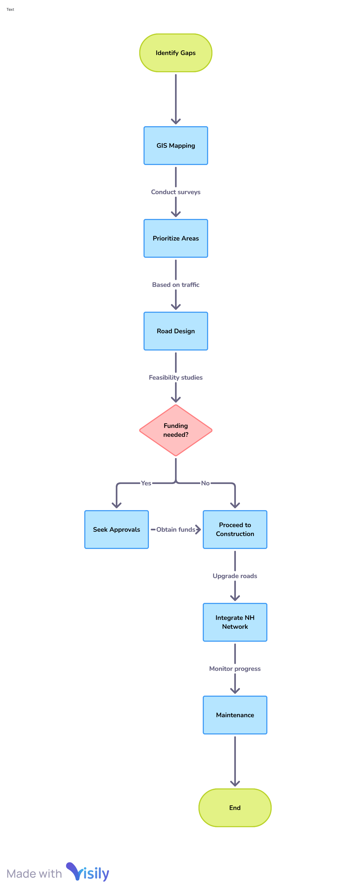
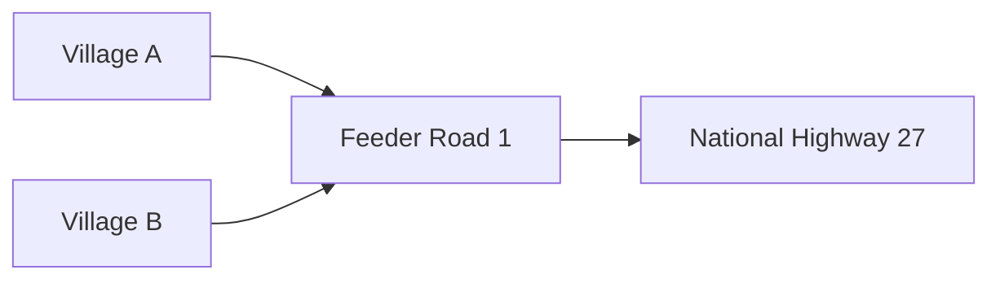

# Proposal for Improving Last-Mile Connectivity to National Highways

## 1. Introduction

Last-mile connectivity refers to the final leg of a journey that connects the end user or destination with the core transport network—in this case, the national highways. Efficient last-mile access is crucial for enabling seamless freight movement, reducing travel time, improving economic activities in rural and peri-urban areas, and enhancing public mobility.

This proposal outlines the technical, infrastructural, and policy-oriented strategies for improving last-mile connectivity to national highways in India.

**Why it matters**:
- Boosts logistics efficiency and reduces overall transportation costs.
- Enables farmers, SMEs, and local industries better access to national and international markets.
- Promotes rural and regional development by linking underserved areas.
- Supports the objectives of Bharatmala Pariyojana and PM Gati Shakti Master Plan.

**Who this guide is for**:
- Transport and infrastructure planners  
- Civil engineers and contractors  
- Government policy-makers  
- Urban and rural development authorities  
- GIS analysts and project managers  

---

## 2. Key Terminology

- **Last-Mile Connectivity**: The final leg of the transportation network that links a destination (e.g., village, factory) to a broader infrastructure system like national highways.
- **National Highways (NH)**: A network of roads managed by the central government, providing interstate and strategic connectivity.
- **Bharatmala Pariyojana**: A government initiative to improve road infrastructure and connectivity across India.
- **PM Gati Shakti**: A digital platform and master plan that integrates various infrastructure schemes for better planning and execution.
- **Rural Link Roads**: Roads that connect villages and rural areas to larger road networks.
- **Multimodal Transport**: Integration of different types of transport (road, rail, air, etc.) to improve overall mobility.
- **Right of Way (RoW)**: The legal right to build or access infrastructure through a given path or land.

---

## 3. Technical Overview

Improving last-mile connectivity involves planning, designing, and implementing feeder roads or link roads that tie remote areas to the primary network of national highways. The approach includes surveying existing gaps, upgrading infrastructure, aligning with national policies, and integrating data for decision-making.

### Process Flow

{ width="400px" style="border: 1px solid #ccc; border-radius: 8px;"}

## Tools & Frameworks

- **GIS Platforms**: For mapping underserved areas.
- **Bharatmala GIS Portal**: For integration with existing NH planning.
- **CRIF (Common Road Infrastructure Framework)**: Proposed framework for unified road asset planning.
- **Public-Private Partnership (PPP)**: Funding model for development.

---

## 4. Step-by-Step Guide or Workflow

### 4.1 Planning & Assessment
- **Data Collection**: Use GIS tools to identify villages, markets, and industrial units lacking NH access within 10–20 km.
- **Gap Analysis**: Match existing roads with potential connectivity corridors.
- **Stakeholder Consultation**: Engage local authorities, businesses, and residents.

### 4.2 Feasibility & Design
- **Traffic & Load Analysis**: Evaluate vehicle types, traffic volume, seasonal patterns.
- **Geotechnical Survey**: Assess soil conditions, flood zones, and terrain.
- **Prepare DPRs (Detailed Project Reports)**: Include cost estimates, environmental clearances, RoW, etc.

### 4.3 Execution
- **Funding Allocation**: Explore options via PMGSY, Bharatmala, state funds, or PPP.
- **Tendering & Contracting**: Invite bids and assign qualified contractors.
- **Construction & Supervision**: Ensure quality through site audits and material testing.

### 4.4 Integration & Maintenance
- **Road Signage & Safety**: Install proper signage, guardrails, drainage, etc.
- **Monitoring**: Use IoT sensors or drones for ongoing assessment.
- **Maintenance Contracts**: Engage local bodies for upkeep under performance-based models.

---

## 5. Best Practices

- **Align with National Frameworks**: Ensure consistency with Bharatmala and PM Gati Shakti objectives.
- **Use Local Materials**: Reduce cost and promote sustainability.
- **Engage Communities**: Include local users in design and feedback.
- **Digital Tracking**: Monitor progress via GIS and project dashboards.
- **Environmental Considerations**: Use eco-friendly designs and avoid disrupting sensitive habitats.

---

## 6. Common Issues & Troubleshooting

| Issue                  | Cause                          | Solution                                                  |
|------------------------|--------------------------------|-----------------------------------------------------------|
| Delayed Land Acquisition | Poor coordination              | Early engagement with landowners and legal facilitation   |
| Cost Overruns           | Inaccurate estimates           | Use standardized DPR templates and validation tools       |
| Poor Road Quality       | Substandard material or oversight | Independent quality checks and on-site engineers         |
| Seasonal Inaccessibility | Flood-prone or hilly regions   | Use raised embankments, proper drainage, weather-resistant surfaces |
| Lack of Utilization     | Poor design alignment          | Community surveys and usage pattern forecasting           |

---

## 7. References

- Bharatmala Pariyojana Official Portal  
- PM Gati Shakti Master Plan  
- Rural Road Planning Toolkit – World Bank  
- Indian Roads Congress (IRC) Guidelines  
- National Highway Authority of India (NHAI)

---

## 8. Appendix

### Sample GIS Mapping Output

### Sample Budget Table
|Item	|Estimated Cost | (INR Lakhs/km) | Remarks |
|-------|---------------|----------------|---------|
|Land Acquisition |	15	| Varies by region|        |
|Road Construction | 35 |Including drainage|       |
|Safety Infrastructure| 5| Signage, railings|      |
|Total |	55| Per km |                           |

